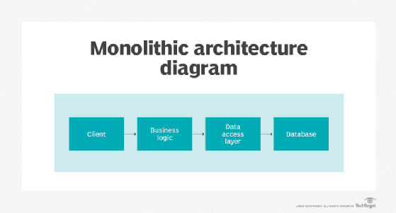
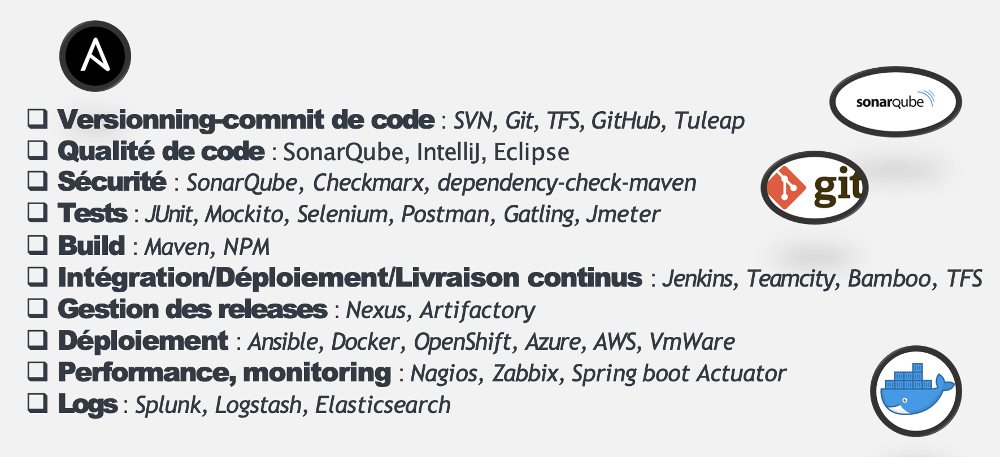
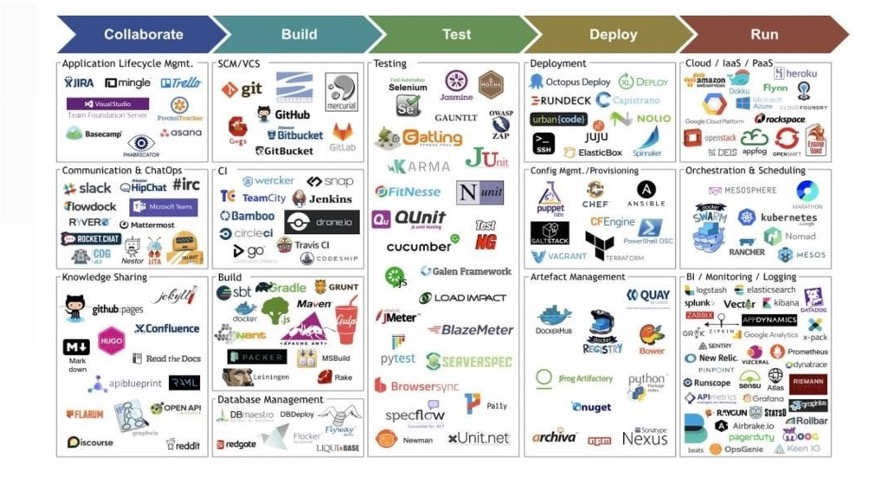
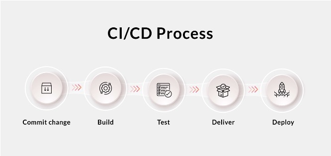
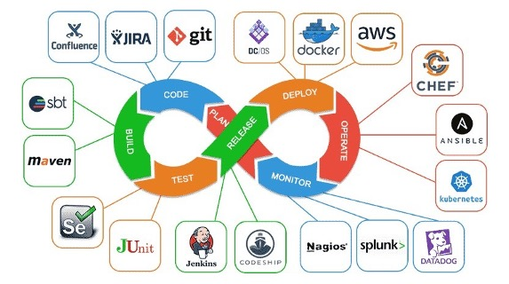
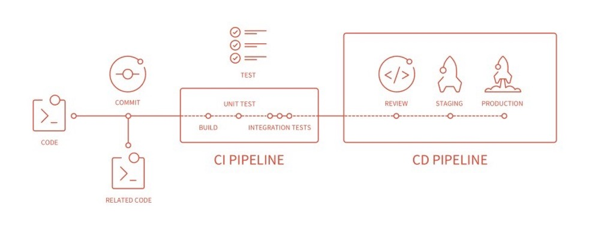

<!-- _class: lead -->
<!-- _paginate: false -->

# Securité System et Réseau

---

## Sommaire


<div style="font-size:35px">


- Fondamentaux de la sécurité informatique
- Sécurité des systèmes d'exploitation
- Sécurité réseau
- Cryptographie et gestion des clés
- Gestion des vulnérabilités et des risques
- Sécurité des applications et du développement
- Conformité et normes de sécurité


</div>

--- 


<!-- _class: lead -->
<!-- _paginate: false -->

## Fondamentaux de la sécurité informatique

---

## Fondamentaux de la sécurité informatique

**Definition**

<div style="font-size:30px">

 - L'architecture logicielle se réfère à la structuration fondamentale d'un système logiciel. 
  
 - Elle consiste en la définition des différents composants logiciels (ou modules), les relations qu'ils entretiennent entre eux, et les principes de conception qui guident leur organisation et leur intégration au sein du système. 
 - Imaginez l'architecture logicielle comme le plan d'un bâtiment, décrivant non seulement les pièces (composants logiciels) mais aussi comment elles sont connectées (communications) et où elles sont placées (déploiement).

</div>

 
--- 

## Architecture Applicative
#### Quel type d’architecture logicielle?
<br>

<div style="font-size:22px">


    
<center>

</center>
    


---


<!-- _class: lead -->
<!-- _paginate: false -->

## Sécurité des systèmes d'exploitation

---


## Sécurité des systèmes d'exploitation

#### La Définition ?

<br>

<div style="font-size:35px">

La sécurité des systèmes d'exploitation (OS) fait référence à un ensemble de pratiques, de mesures et de technologies visant à protéger les systèmes d'exploitation contre les menaces potentielles, telles que les accès non autorisés, les attaques de logiciels malveillants, les vulnérabilités de sécurité et les erreurs de configuration.

</div>

---

## Sécurité des systèmes d'exploitation

#### Les aspects essentiels

<br>

<div style="font-size:30px">

<div class="columns">

<div>

- Authentification et autorisation 

- Protection contre les logiciels malveillants 

- Mises à jour de sécurité 

- Chiffrement des données

- Surveillance et journalisation

</div>

<div>

- Gestion des vulnérabilités 

- Sécurisation des configurations 

- Sécurisation des réseaux

- Éducation et sensibilisation

</div>


</div>

---

## Sécurité des systèmes d'exploitation

#### Mises à jour régulières

<br>

<div style="font-size:23px">

1. **Utilisation de gestionnaires de paquets :**
   - Sur les distributions comme Ubuntu, utilisez `apt` pour mettre à jour les paquets système :
     ```bash
     sudo apt update
     sudo apt upgrade
     ```
   - Sur les distributions comme CentOS/RHEL, utilisez `yum` ou `dnf` :
     ```bash
     sudo yum update
     ```
     ou

     ```bash
     sudo dnf update
     ```

---
## Sécurité des systèmes d'exploitation

#### Mises à jour régulières

<br>

<div style="font-size:25px">


2. **Configurer les mises à jour automatiques :**
   - Vous pouvez configurer votre système pour qu'il vérifie et installe automatiquement les mises à jour de sécurité. Par exemple, sur Ubuntu, vous pouvez utiliser `unattended-upgrades`.

3. **Vérifier régulièrement les mises à jour :**
   - Planifiez un horaire régulier pour vérifier les mises à jour disponibles et les appliquer. Par exemple, configurez une tâche cron pour exécuter `apt update` et `apt upgrade` toutes les semaines.

--- 
## Sécurité des systèmes d'exploitation

#### Mises à jour régulières


<div style="font-size:23px">

4. **Mises à jour des applications tierces :**
   - Si vous utilisez des logiciels tiers ou des applications non incluses dans les dépôts officiels de votre distribution, assurez-vous de suivre les instructions de mise à jour fournies par les développeurs de ces applications.

5. **Surveillance des annonces de sécurité :**
   - Abonnez-vous aux listes de diffusion de sécurité de votre distribution Linux pour être informé des nouvelles vulnérabilités et des correctifs disponibles.

6. **Utilisation de gestionnaires de version pour les environnements de développement :**
   - Si vous développez ou utilisez des applications basées sur des environnements comme Python, Node.js, etc., utilisez des gestionnaires de version comme `pip` ou `npm` pour gérer les mises à jour des bibliothèques et des dépendances.


---

## Sécurité des systèmes d'exploitation
#### Utilisation de comptes avec privilèges minimaux
<br>
    
<div>

Les principes de moindre privilège sont des principes de sécurité informatique visant à limiter les droits et les privilèges des utilisateurs, des applications et des processus au niveau minimum nécessaire pour accomplir leurs tâches spécifiques.


</div>
    

---
## Sécurité des systèmes d'exploitation
#### Utilisation de comptes avec privilèges minimaux
<br>
    
<div style="font-size:25px">

1. **Privilèges administratifs restreints :**

- Limitez l'accès administratif aux seules personnes et aux seules ressources nécessaires pour effectuer des tâches administratives spécifiques. Évitez de donner des droits d'administration complets à des utilisateurs qui n'en ont pas besoin.
  
2. **Contrôle d'accès basé sur le rôle (RBAC) :**

- Utilisez le RBAC pour attribuer des droits d'accès en fonction des rôles spécifiques des utilisateurs dans l'organisation. Cela garantit que chaque utilisateur a uniquement les permissions nécessaires pour accomplir ses responsabilités.


</div>

---
## Sécurité des systèmes d'exploitation
#### Utilisation de comptes avec privilèges minimaux
<br>
    
<div style="font-size:27px">

3. **Principe du besoin de savoir :**

- Appliquez ce principe en limitant l'accès à l'information uniquement aux personnes qui ont besoin de connaître cette information pour effectuer leur travail.


4. **Examen des privilèges :**

- Passez régulièrement en revue les privilèges accordés aux utilisateurs et aux applications pour vous assurer qu'ils restent pertinents et nécessaires.


</div>

---

## Sécurité des systèmes d'exploitation
#### Utilisation de comptes avec privilèges minimaux
<br>
    
<div style="font-size:27px">

5. **Privilèges par défaut :**

- Configurez les systèmes et les applications avec les privilèges par défaut les plus bas possibles, puis accordez des privilèges supplémentaires au cas par cas, si nécessaire.
  
6. **Surveillance et audit :**

- Surveillez l'utilisation des privilèges et auditez régulièrement les activités des utilisateurs et des applications pour détecter toute anomalie ou utilisation abusive.


</div>

---

## Sécurité des systèmes d'exploitation
#### Utilisation de comptes avec privilèges minimaux
<br>
    
<center>

</center>
    
---
## Sécurité des systèmes d'exploitation
#### Contrôle des accès

<br>

- Les modèles de contrôle d'accès sont essentiels pour gérer et restreindre l'accès aux ressources d'un système informatique. 
- Les principaux modèles de contrôle d'accès : Discretionary Access Control (DAC), Mandatory Access Control (MAC) et Role-Based Access Control (RBAC).

---

## Sécurité des systèmes d'exploitation
#### Contrôle des accès


<div style="font-size:23px">

### 1. Discretionary Access Control (DAC)
<br>

**Définition**:
Le modèle de contrôle d'accès discrétionnaire (DAC) est un modèle où les propriétaires de ressources ou d'objets ont le pouvoir de décider qui peut accéder à leurs ressources et avec quels privilèges.
<br>

**Caractéristiques**:
- **Flexibilité** : Les utilisateurs ont la liberté de partager leurs ressources avec d'autres.
- **Contrôle par l'utilisateur** : Le contrôle d'accès est basé sur les identités des utilisateurs et les permissions définies par les propriétaires des ressources.
- **Permissions basées sur les fichiers** : Les permissions sont souvent gérées par les propriétaires des fichiers et des répertoires.

</div>

---

## Sécurité des systèmes d'exploitation
#### Contrôle des accès

<br>

<div style="font-size:30px">

**Exemple**:

Environnement UNIX/Linux où les propriétaires de fichiers peuvent définir les permissions d'accès pour leurs fichiers en utilisant des commandes comme `chmod`.

```bash
chmod 755 fichier.txt
```

</div>

---

## Sécurité des systèmes d'exploitation
#### Contrôle des accès

<div style="font-size:22px">

### 2. Mandatory Access Control (MAC)
<br>

**Définition**:

Le modèle de contrôle d'accès obligatoire (MAC) est un modèle où l'accès aux ressources est contrôlé par des politiques de sécurité centralisées définies par l'administration système et non par les propriétaires des ressources.

<br>

**Caractéristiques**:
- **Centralisation** : Les décisions d'accès sont prises par un administrateur central et non par les utilisateurs individuels.
- **Labels de sécurité** : Les objets (fichiers, données) et sujets (utilisateurs, processus) sont assignés des labels de sécurité.
- **Politiques strictes** : Les politiques de sécurité sont strictes et non modifiables par les utilisateurs.

</div>

---

## Sécurité des systèmes d'exploitation
#### Contrôle des accès

<br>

<div style="font-size:30px">

**Exemple**:
SElinux (Security-Enhanced Linux) est un exemple de mise en œuvre de MAC où les politiques de sécurité sont définies par l'administrateur et appliquées strictement.

```bash
sestatus
```

</div>

---

## Sécurité des systèmes d'exploitation
#### Contrôle des accès

<div style="font-size:21px">

### 3. Role-Based Access Control (RBAC)
<br>

**Définition**:
Le modèle de contrôle d'accès basé sur les rôles (RBAC) est un modèle où les permissions sont associées à des rôles spécifiques et les utilisateurs se voient attribuer ces rôles. Les utilisateurs obtiennent les permissions en fonction de leurs rôles.

<br>

**Caractéristiques**:
- **Rôles et Permissions** : Les permissions sont assignées à des rôles plutôt qu'à des utilisateurs individuels.
- **Gestion simplifiée** : La gestion des permissions est simplifiée en attribuant ou retirant des rôles aux utilisateurs.
- **Séparation des responsabilités** : Facilite la séparation des responsabilités et la conformité réglementaire.
</div>

---
## Sécurité des systèmes d'exploitation
#### Contrôle des accès

<div style="font-size:26px">

<br>

**Exemple  :** 

<br>

- Pour des contrôles d'accès plus fins que ceux offerts par les permissions de base (rwx), utilisez les ACL pour définir des permissions sur des fichiers et des répertoires spécifiques.
- Cela permet de limiter l'accès en fonction des besoins spécifiques des rôles.
<br>

**Utilisation de setfacl pour ajouter des ACL :**

   ```bash
   setfacl -m u:utilisateur1:rw fichier.txt
   ```


---

## Sécurité des systèmes d'exploitation
#### Contrôle des accès
<br>
    
<center>

</center>
    
---


## Sécurité des systèmes d'exploitation
#### Désactivation des services inutiles

<br>

<div style="font-size:35px">


La désactivation des services inutiles et la fermeture des ports non utilisés sur Linux sont des pratiques essentielles pour renforcer la sécurité et réduire la surface d'attaque de votre système


</div>

---
## Sécurité des systèmes d'exploitation
#### Désactivation des services inutiles

<div style="font-size:30px">

<br>

- **Principes de la désactivation des services inutiles :**


  - **Moins de services** en cours d'exécution signifie moins de points d'entrée potentiels pour les attaquants. 
  - Chaque service ou processus actif représente une surface d'attaque supplémentaire pour des vulnérabilités potentielles.
  - En désactivant **les services non essentiels**, vous réduisez la probabilité qu'un service mal configuré ou non mis à jour soit exploité pour compromettre votre système.

</div>

---

## Sécurité des systèmes d'exploitation
#### Désactivation des services inutiles
<br>
    
<center>

</center>
    
---


## Sécurité des systèmes d'exploitation
#### Chiffrement des données

<br>

<div style="font-size:35px">


- Le chiffrement est une technique essentielle en sécurité informatique pour protéger les données contre l'accès non autorisé. 
- Il existe deux principaux types de chiffrement : le chiffrement symétrique et le chiffrement asymétrique. 


</div>

---

## Sécurité des systèmes d'exploitation
#### Chiffrement des données

<br>

<div style="font-size:26px">

**Définition**:
Le chiffrement symétrique utilise une seule clé pour chiffrer et déchiffrer les données. Cette clé doit être partagée entre les parties communicantes de manière sécurisée.
<br>

**Caractéristiques**:
- **Clé Unique** : La même clé est utilisée pour le chiffrement et le déchiffrement.
- **Rapidité** : Les algorithmes de chiffrement symétrique sont généralement plus rapides et nécessitent moins de ressources que les algorithmes asymétriques.
- **Sécurité de la Clé** : La sécurité repose entièrement sur le secret de la clé. Si la clé est compromise, les données chiffrées le sont également.


</div>


---

## Sécurité des systèmes d'exploitation
#### Chiffrement des données

<br>

<div style="font-size:26px">

**Définition**:
Le chiffrement symétrique utilise une seule clé pour chiffrer et déchiffrer les données. Cette clé doit être partagée entre les parties communicantes de manière sécurisée.
<br>

**Caractéristiques**:
- **Clé Unique** : La même clé est utilisée pour le chiffrement et le déchiffrement.
- **Rapidité** : Les algorithmes de chiffrement symétrique sont généralement plus rapides et nécessitent moins de ressources que les algorithmes asymétriques.
- **Sécurité de la Clé** : La sécurité repose entièrement sur le secret de la clé. Si la clé est compromise, les données chiffrées le sont également.


</div>


---

<!-- _class: lead -->
<!-- _paginate: false -->

## Intégration Continue - Deploiement Continu (CI-CD)

---

## CI-CD
#### Définition

<br>

<div style="font-size:40px">

<br>

L’approche CI/CD permet d’augmenter la fréquence de distribution des applications grâce à l’introduction de l’automatisation au niveau des étapes de développement des applications.


</div>

---

## CI-CD
#### Définition


<div style="font-size:22px">


- **Intégration continue**
  - Une méthode de développement logiciel dans laquelle le logiciel est reconstruit et test ́e `a chaque modification apportée par un programmeur.

- **Livraison continue**
  - La livraison continue est une approche dans laquelle l’intégration continue associée à des techniques de déploiement automatiques assurent une mise en production rapide et fiable du logiciel.

- **Déploiement continu**
  - Le déploiement continu est une approche dans laquelle chaque modification apportée par un programmeur passe automatiquement toute la chaîne allant des tests à la mise en production. Il n’y a plus d’intervention humaine.


</div>

---

## CI-CD
#### Les avantages CI-CD

<div style="font-size:40px">

<br>

- **Accélérer le Time-to-Market** (le temps de développement et de mise en production d'une fonctionnalité).
- **Réduire les erreurs** lors des livraisons.
- **Assurer une continuité** de service des applications.


</div>

---

## CI-CD
#### Les principes etapes du CI-CD

<div style="font-size:35px">


1. **Récupération :** code source récupéré du gestionnaire
2. **Création :** compilation de l’application
3. **Test :** test du code et notamment tests automatisés
4. **Lancement :** distribution de l’application au référentiel
5. **Déploiement :** déploiement du code en production
6. **Validation et conformité :** ces étapes de validation sont à adapter en fonction des besoins de l’entreprise


</div>

---

## CI-CD
#### Les outils CI-CD
<br>
    
<center>

</center>
    
---

## CI-CD
#### Les outils CI-CD
<br>
    
<center>

</center>
    
---
## CI-CD
#### Les outils CI-CD
<br>
    
<center>

</center>
    
---
## CI-CD
#### Les outils CI-CD
<br>
    
<center>

</center>
    
---

## CI-CD
#### Les outils CI-CD
<br>
    
<center>

</center>
    
